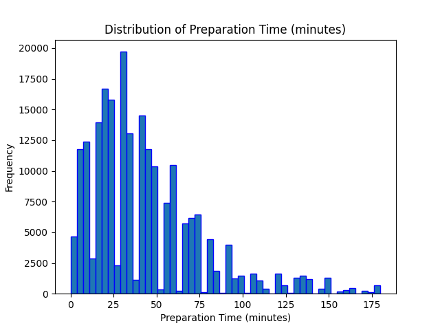
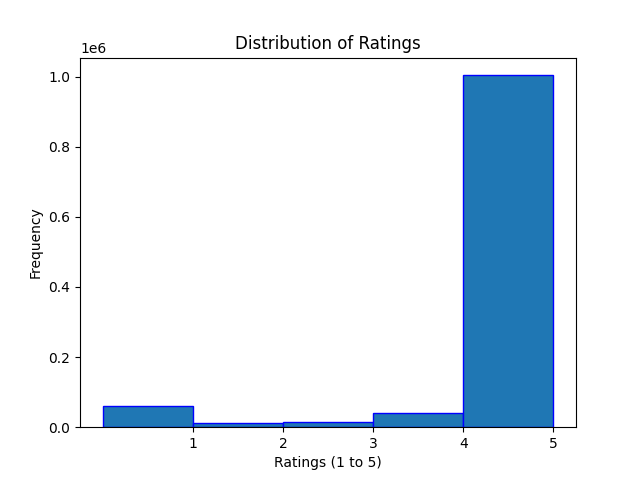
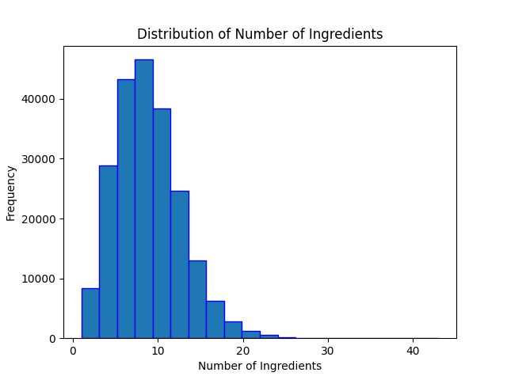
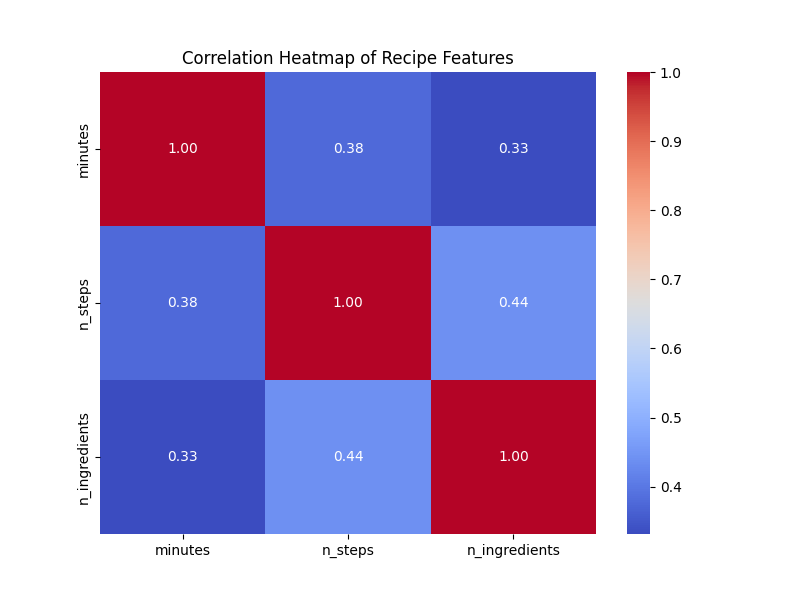
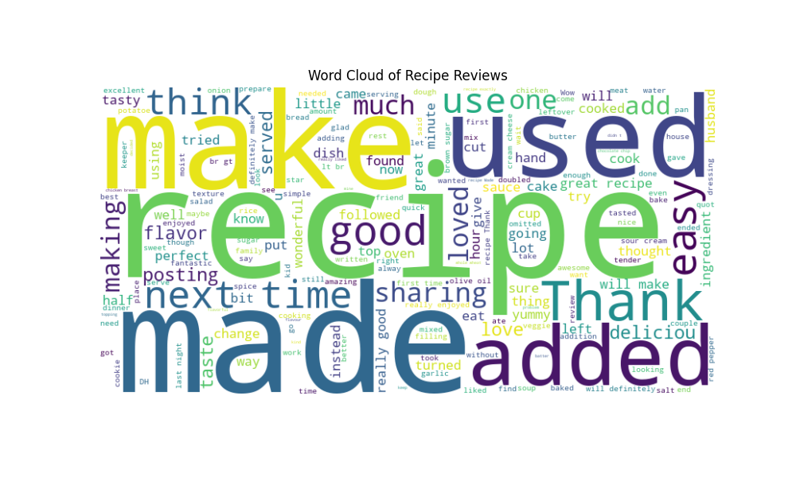

# Food Recipe Recommender with Incredient Substitutions

Problem: Create a recommendation system that suggests recipes based on
available ingredients and offers ingredient substitution options.

Dataset: Food.com Recipes and Interactions

This was the problem I chose as part of Quantic's Data Science Foundations Capstone. 

```text
recipe-recommender/
│── .venv/                          # Virtual environment (not in Git)
│── food-recipe-recommender/
│   ├── src/
│   │   ├── data/                   # Datasets (not in Git)
│   │   ├── __init__.py             # Python entry point for src module
│   │   ├── preprocessing.py        # Data cleaning
│   │   ├── feature_engineering.py  # Feature engineering file
│   │   ├── feature_selection.py    # Feature selection file
│   │   ├── modeling.py             # File for modeling
│   │   ├── validation_checks.py    # Developed validation checks
│   │── app.py                      # Streamlit application
│   │── main.py                     # Main model pipeline
├── images/                         # Output images
│── .gitignore                      # Git ignore config file
│── LICENSE                         # How the app can be used
│── README.md                       # Instructions for use
│── recipe_recommender_mode.joblib  # Saved model
│── requirements.txt                # Dependencies
│── selected_features.csv           # CSV output from the model
```

## Installation

This is for windows because Unix operating systems can install virtualenv as a package outside of `pip`.

```bash
pip install virtualenv
python -m venv .venv
```

and since i use Git Bash on Windows we need to activate that correctly.

`source .venv/Scripts/activate`

or if you're using powershell you can

`.venv\Scripts\activate.ps1`

and we can get on with it.

`pip install -r requirements.txt`

## Get the Data

The data can be directly downloaded from the following bash script using your terminal.

```bash
curl -L -o ~/Downloads/recipe-recommender-data.zip\
  https://www.kaggle.com/api/v1/datasets/download/shuyangli94/food-com-recipes-and-user-interactions
```

Unzip the file downloaded to your downloads file and move the extracted `recipe-recommender-data` to `data` folder under `src`. Note: Running this code block will download the zip file.

## Run the model

You can run this locally in two different ways. 

1. Run an interactive version using Steamlit. This will walk you through the steps of loading and 
evaluating the model. 
`steamlit run food-recipe-recommender/app.py` 

2. Running the model through terminal, the output of which is continued in this README.
`python food-recipe-recommender/main.py`

## Main.py Pipeline Output

```bash
Original dataset size: 231637 recipes
Original dataset size: 226657 recipes
Filtered dataset size: 214249 recipes
Filtered dataset size: 214249 recipes
```







```bash
Selected features saved to 'selected_features.csv'.
Model training completed.
Accuracy: 0.9978296382730455
Precision: 0.9974639578796483
Recall: 0.9999723650030399
F1 Score: 0.9987165863958158
ROC-AUC Score: 0.9999993655230289

Confusion Matrix:
[[ 6572    92]
 [    1 36185]]
```

## Understanding the output

#### Data Preprocessing
The process began with a substantial dataset of 231,637 recipes, which was then filtered down to 214,249 recipes. This filtering likely involved:
- Removing incomplete or low-quality recipe entries
- Eliminating recipes with missing critical information
- Potentially removing outliers or duplicates
- Selecting only the most relevant features for the recommendation system

#### Feature Selection
The output mentions "Selected features saved to 'selected_features.csv'", which suggests:
- The model underwent a feature selection process
- Important characteristics were identified to improve prediction accuracy
- Irrelevant or redundant features were likely removed to prevent overfitting

#### Model Performance Breakdown

1. **Accuracy (99.78%)**
   - Represents the proportion of total correct predictions
   - Nearly perfect classification of recipes
   - Indicates the model can correctly categorize or predict recipe characteristics with extremely high reliability

2. **Precision (99.75%)**
   - Measures the accuracy of positive predictions
   - Extremely low false positive rate
   - When the model predicts a specific recipe characteristic, it's almost always correct

3. **Recall (99.99%)**
   - Measures the model's ability to find all positive instances
   - Almost perfect at identifying relevant recipes
   - Captures nearly all relevant recipes in the dataset

4. **F1 Score (99.87%)**
   - Harmonic mean of precision and recall
   - Provides a balanced measure of the model's performance
   - Confirms the model's exceptional ability to classify recipes

5. **ROC-AUC Score (99.99%)**
   - Measures the model's ability to distinguish between classes
   - A score this close to 1 indicates near-perfect separation between different recipe categories or characteristics

#### Confusion Matrix Analysis
The confusion matrix reveals:
- 6,572 true negative predictions
- 36,185 true positive predictions
- Only 92 false positive predictions
- Just 1 false negative prediction

This suggests the model is:
- Extremely precise in its recommendations
- Rarely makes mistakes
- Highly reliable for recipe classification or recommendation

### Potential Use Cases
This could be a recommender system for:
- Suggesting recipes based on specific criteria
- Classifying recipes by cuisine, dietary restrictions, or cooking style
- Predicting recipe popularity or user preferences

Would you like me to elaborate on any specific aspect of the model or its performance?

## What to do next?

Let's add some validation checks to ensure the high model results are accuracte and not a result
of something like data leakage. 

```python
--- Class Distribution Check ---
Class Distribution in Training Set:
rating_binary
1    0.843576
0    0.156424
Name: proportion, dtype: float64
Class Distribution in Test Set:
rating_binary
1    0.844481
0    0.155519
Name: proportion, dtype: float64

--- Data Leakage Check ---
No data leakage detected.

--- Feature Correlations ---
Feature Correlations with Target:
rating_binary       1.000000
avg_rating          0.793529
num_interactions    0.022794
n_ingredients      -0.000681
complexity_score   -0.017954
n_steps            -0.028721
minutes            -0.031827
Name: rating_binary, dtype: float64

--- Model Training Completed ---
Accuracy: 0.9978296382730455
Precision: 0.9974639578796483
Recall: 0.9999723650030399
F1 Score: 0.9987165863958158
ROC-AUC Score: 0.999999365523029

Confusion Matrix:
[[ 6572    92]
 [    1 36185]]

--- Cross-Validation ---
Performing cross-validation...
Cross-Validation F1 Scores: [0.99892911 0.99868766 0.99863593 0.99884277 0.99891182]
Mean F1 Score: 0.9988014611846017

--- Sample Prediction Review ---
Sample Predictions: [1 1 1 1 1 1 1 1 1 1]
Sample True Labels: [1 1 1 1 1 1 1 1 1 1]
```

1. The binary classification target is directly derived from `avg_rating` (recipes with rating ≥ 4.0 are labeled as 1, others as 0)
2. The high correlation with `avg_rating` is expected and not a data leak
3. The data leakage check confirmed no inappropriate data overlap

In this context, the strong correlation between `avg_rating` and `rating_binary` is by design, not a problem. The logistic regression is essentially learning to classify recipes based on whether they're likely to have a high rating, using various features as predictors.

The near-perfect metrics suggest the model is very good at predicting high-rated recipes based on the available features. The imbalanced dataset (84% high-rated recipes) is also typical in rating-based classification.

The current implementation looks sound. 

## Author
Jasen Carroll \
08 Feb 2025